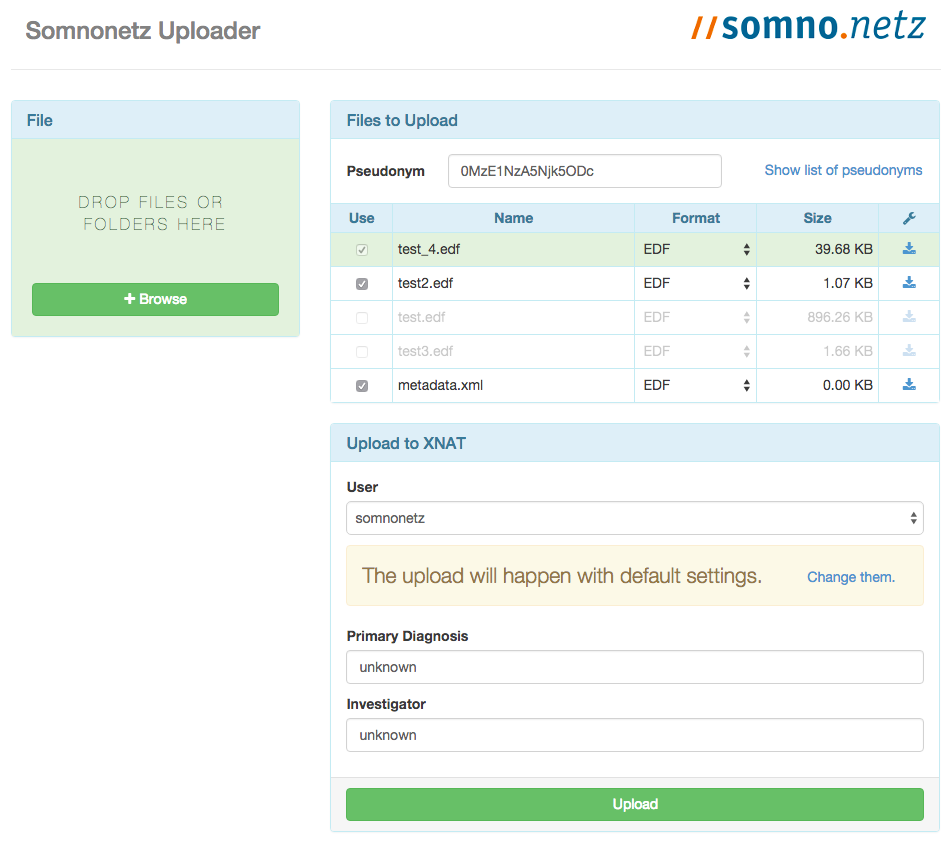

# PSG-Uploader

Web app for client-side pseudonymization of medical data and easy uploading to XNAT




## Up and running

```sh
npm install
gulp

# python -m SimpleHTTPServer

# for production JS use
# gulp build
```


## Disable [SOP](https://en.wikipedia.org/wiki/Same-origin_policy) (in Chrome)

```sh
   # OSX
   open -a Google\ Chrome --args --disable-web-security
   open -a Google\ Chrome\ Canary --args --disable-web-security

   # Linux
   google-chrome --disable-web-security

   # Windows
   "\Google\Chrome\Application\chrome.exe --disable-web-security"
```


## Events

```yaml
File:
   loaded

XNAT:
   logged_in
   subject_created
   session_created
   scan_created
   resource_created
   file_uploaded
   pipeline_started
```
